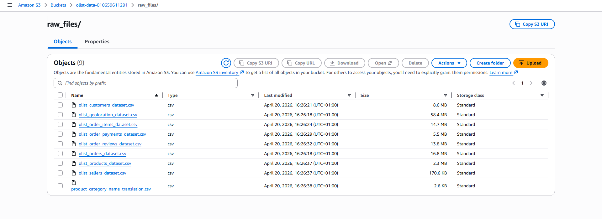
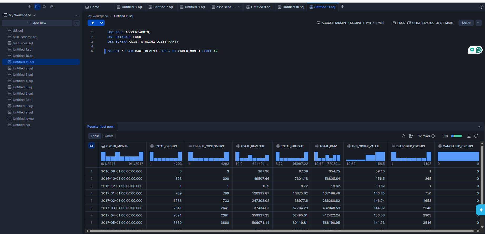
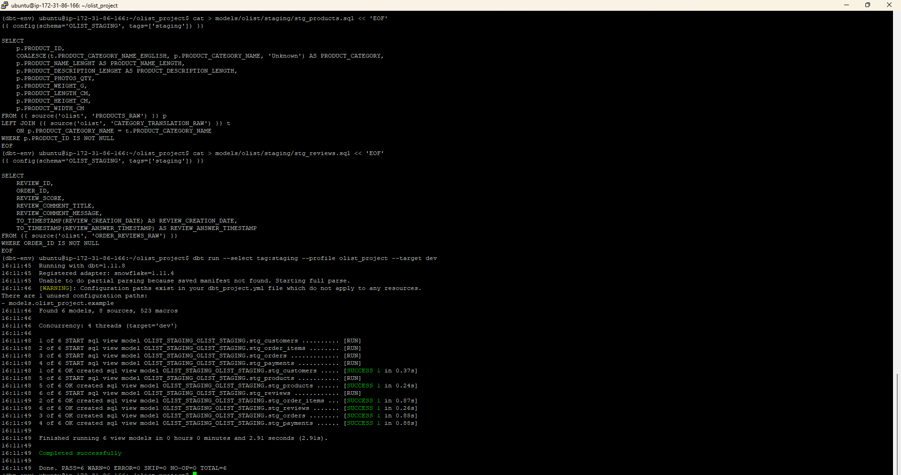
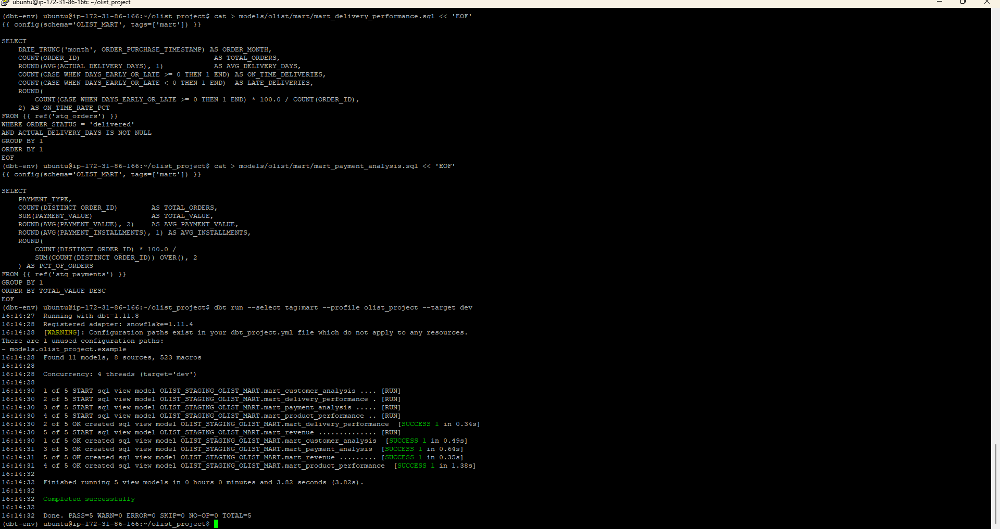
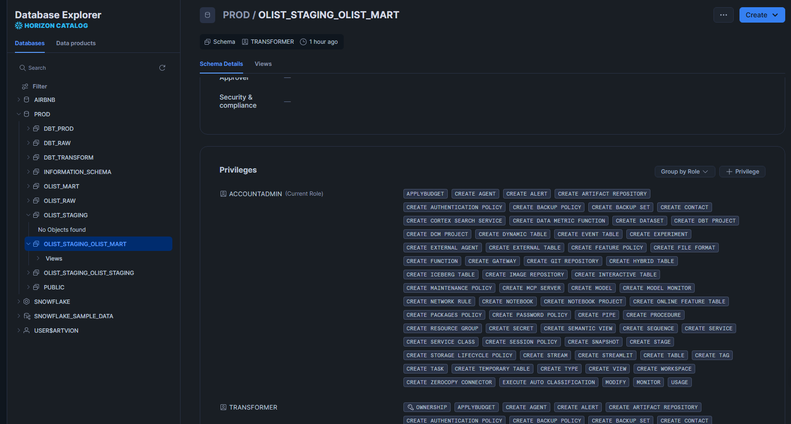
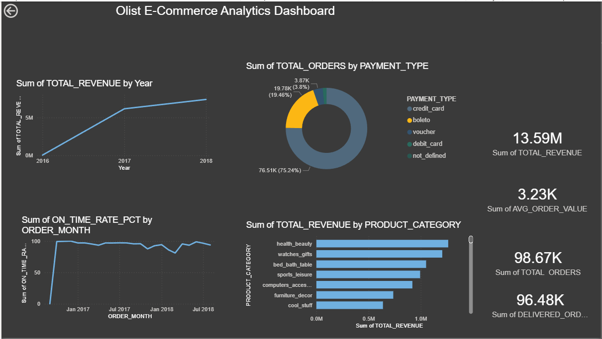

🛒 Olist E-Commerce Analytics Pipeline
> A production-grade end-to-end data engineering pipeline that ingests real Brazilian e-commerce data from AWS S3, transforms it through layered dbt models in Snowflake, and visualises insights in a Power BI executive dashboard — fully automated with Apache Airflow on AWS EC2.
---
📌 Table of Contents
Project Overview
Architecture
Tech Stack
Dataset
Project Structure
Data Models
Dashboard
Setup Guide
Running the Pipeline
Setbacks & Lessons Learned
Screenshots
Author
---
📖 Project Overview
This project builds a complete analytics platform for a real e-commerce business using the Olist Brazilian E-Commerce dataset — 100,000 real orders from a Brazilian marketplace.
The pipeline answers real business questions:
Which product categories generate the most revenue?
How is delivery performance trending month over month?
Which payment methods do customers prefer?
Which states have the highest customer spend?
What is the average order value and how is it changing?
Real-world equivalent: This is the type of analytics infrastructure that companies like Jumia, Konga, and Flutterwave use to power their business decisions.
---
🏗️ Architecture
```
┌─────────────────────────────────────────────────────────────────┐
│                      AWS EC2 (Ubuntu 24.04)                     │
│                                                                 │
│  ┌──────────────┐    ┌──────────────┐    ┌──────────────────┐  │
│  │   AWS S3     │    │   Python     │    │    Snowflake     │  │
│  │              │    │  Ingestion   │    │                  │  │
│  │  9 CSV files │───▶│   Script     │───▶│  OLIST_RAW       │  │
│  │  (1.5M rows) │    │              │    │  (9 raw tables)  │  │
│  └──────────────┘    └──────────────┘    └────────┬─────────┘  │
│                                                   │             │
│                                                   ▼             │
│                                         ┌──────────────────┐   │
│                                         │      dbt         │   │
│                                         │                  │   │
│                                         │  OLIST_STAGING   │   │
│                                         │  (6 clean views) │   │
│                                         │                  │   │
│                                         │  OLIST_MART      │   │
│                                         │  (5 mart tables) │   │
│                                         └────────┬─────────┘   │
│                                                  │              │
│                                                  ▼              │
│                                         ┌──────────────────┐   │
│                                         │    Power BI      │   │
│                                         │                  │   │
│                                         │ Executive        │   │
│                                         │ Dashboard        │   │
│                                         └──────────────────┘   │
└─────────────────────────────────────────────────────────────────┘
```
---
🛠️ Tech Stack
Technology	Purpose	Version
Python	Data ingestion from S3 to Snowflake	3.12
AWS S3	Raw data storage (data lake)	-
AWS SSM	Secure credential management	-
AWS IAM	Access control	-
Snowflake	Cloud data warehouse	Standard Edition
dbt	Data transformation and modeling	1.11.8
Power BI	Business intelligence dashboard	Desktop
Apache Airflow	Pipeline orchestration	2.9.3
Docker	Containerised Airflow deployment	29.4.0
AWS EC2	Cloud server	Ubuntu 24.04
---
📊 Dataset
Source: Olist Brazilian E-Commerce Dataset from Kaggle
Real transaction data from Olist — a Brazilian e-commerce marketplace — covering 2016 to 2018.
File	Table	Rows	Description
`olist_orders_dataset.csv`	ORDERS_RAW	99,441	Master orders table
`olist_customers_dataset.csv`	CUSTOMERS_RAW	99,441	Customer information
`olist_order_items_dataset.csv`	ORDER_ITEMS_RAW	112,650	Line items per order
`olist_order_payments_dataset.csv`	ORDER_PAYMENTS_RAW	103,886	Payment details
`olist_order_reviews_dataset.csv`	ORDER_REVIEWS_RAW	99,224	Customer reviews
`olist_products_dataset.csv`	PRODUCTS_RAW	32,951	Product catalog
`olist_sellers_dataset.csv`	SELLERS_RAW	3,095	Seller information
`olist_geolocation_dataset.csv`	GEOLOCATION_RAW	1,000,163	Location coordinates
`product_category_name_translation.csv`	CATEGORY_TRANSLATION_RAW	71	Portuguese → English
Total: 1,550,921 rows of real e-commerce data
---
📁 Project Structure
```
olist-ecommerce-pipeline/
│
├── dags/
│   ├── source_load/
│   │   └── data_load.py          ← Loads all 9 CSVs from S3 to Snowflake
│   └── olist_pipeline_dag.py     ← Airflow DAG orchestrating the pipeline
│
├── models/
│   └── olist/
│       ├── staging/
│       │   ├── src_olist.yml     ← Source definitions
│       │   ├── stg_orders.sql
│       │   ├── stg_customers.sql
│       │   ├── stg_order_items.sql
│       │   ├── stg_payments.sql
│       │   ├── stg_products.sql
│       │   └── stg_reviews.sql
│       └── mart/
│           ├── mart_revenue.sql
│           ├── mart_product_performance.sql
│           ├── mart_customer_analysis.sql
│           ├── mart_delivery_performance.sql
│           └── mart_payment_analysis.sql
│
├── dashboard/
│   └── olist_ecommerce_dashboard.pbix  ← Power BI dashboard file
│
└── README.md
```
---
🔄 Data Models
Staging Layer (OLIST_STAGING)
Clean, typed, and renamed versions of the raw tables. No business logic — just cleaning.
Model	Source	Key Transformations
`stg_orders`	ORDERS_RAW	Cast timestamps, calculate delivery days, early/late flag
`stg_customers`	CUSTOMERS_RAW	Standardise city names with INITCAP
`stg_order_items`	ORDER_ITEMS_RAW	Calculate total item value (price + freight)
`stg_payments`	ORDER_PAYMENTS_RAW	Clean payment types
`stg_products`	PRODUCTS_RAW + CATEGORY_TRANSLATION	Translate category names from Portuguese to English
`stg_reviews`	ORDER_REVIEWS_RAW	Cast timestamps, clean review data
Mart Layer (OLIST_MART)
Business-ready analytics tables — directly consumed by Power BI.
Model	Description	Key Metrics
`mart_revenue`	Monthly revenue trends	Total revenue, GMV, avg order value, delivered vs cancelled
`mart_product_performance`	Revenue by product category	Units sold, avg price, avg review score
`mart_customer_analysis`	Customer behaviour by location	Total customers, spend, satisfaction score
`mart_delivery_performance`	Delivery KPIs by month	Avg delivery days, on-time rate %
`mart_payment_analysis`	Payment method breakdown	Orders per method, avg value, % of total
---
📈 Dashboard
The Power BI executive dashboard answers 5 key business questions:
1. Revenue Trends
Line chart showing monthly revenue from 2016 to 2018. Reveals strong growth trajectory and seasonality patterns.
2. Top Product Categories
Horizontal bar chart showing revenue by category. Health & Beauty, Watches & Gifts, and Bed Bath Table are the top 3.
3. Payment Methods
Donut chart showing payment method distribution. Credit card dominates at 75%, followed by boleto at 19%.
4. Delivery Performance
Line chart showing on-time delivery rate by month. Identifies periods of operational challenges.
5. KPI Cards
Total Revenue: 13.59M
Total Orders: 98.67K
Delivered Orders: 96.48K
Average Order Value: 3.23K
---
🚀 Setup Guide
Prerequisites
AWS account with EC2, S3, SSM, IAM configured
Snowflake account
Power BI Desktop installed
Python 3.12
dbt installed in virtual environment
Step 1 — Upload data to S3
```bash
# Create S3 bucket and upload all 9 CSV files
# Bucket: olist-data-<your-account-id>
# Folder: raw_files/
```
Step 2 — Set up Snowflake schemas
```sql
USE ROLE ACCOUNTADMIN;
USE DATABASE PROD;
CREATE SCHEMA IF NOT EXISTS OLIST_RAW;
CREATE SCHEMA IF NOT EXISTS OLIST_STAGING;
CREATE SCHEMA IF NOT EXISTS OLIST_MART;
GRANT ALL PRIVILEGES ON SCHEMA PROD.OLIST_RAW TO ROLE TRANSFORMER;
GRANT ALL PRIVILEGES ON SCHEMA PROD.OLIST_STAGING TO ROLE TRANSFORMER;
GRANT ALL PRIVILEGES ON SCHEMA PROD.OLIST_MART TO ROLE TRANSFORMER;
```
Step 3 — Store credentials in AWS SSM
```bash
# Required parameters:
# /snowflake/username
# /snowflake/password
# /snowflake/accountname
```
Step 4 — Install Python dependencies
```bash
source ~/airflow-env/bin/activate
pip install pandas "snowflake-connector-python[pandas]" boto3
```
Step 5 — Load raw data
```bash
python3 dags/source_load/data_load.py
```
Step 6 — Run dbt models
```bash
source ~/dbt-env/bin/activate
cd ~/olist_project
dbt run --select tag:staging --profile olist_project --target dev
dbt run --select tag:mart --profile olist_project --target dev
```
Step 7 — Connect Power BI
Server: `<your-account>.snowflakecomputing.com`
Warehouse: `COMPUTE_WH`
Database: `PROD`
Schema: `OLIST_STAGING_OLIST_MART`
Load all 5 mart tables
---
⚠️ Setbacks & Lessons Learned
1. Snowflake privileges error
Error: `SQL access control error: Insufficient privileges`
Fix: Grant explicit privileges on all schemas and future objects to both TRANSFORMER and ACCOUNTADMIN roles
Lesson: Always grant future table/view privileges when setting up schemas — not just current objects
2. dbt schema naming convention
Issue: dbt creates schemas as `<profile_schema>_<model_schema>` not just `<model_schema>`
Example: Models configured with `schema='OLIST_MART'` end up in `OLIST_STAGING_OLIST_MART`
Lesson: Always check the actual schema name in Snowflake after running dbt — don't assume it matches your config exactly
3. Geolocation file size
Issue: The geolocation CSV has 1 million rows — takes several minutes to load
Fix: Load it last after all other tables to not block the pipeline
Lesson: Always profile your data sizes before designing your loading strategy
4. Portuguese category names
Issue: Product categories were in Portuguese — not readable in dashboards
Fix: Used a LEFT JOIN with the translation table in `stg_products.sql`:
```sql
COALESCE(t.PRODUCT_CATEGORY_NAME_ENGLISH, p.PRODUCT_CATEGORY_NAME, 'Unknown')
```
Lesson: Always handle translations and null values in the staging layer before they reach marts
5. Power BI X-axis showing Year instead of Month
Issue: Power BI automatically aggregated ORDER_MONTH to Year level
Fix: Click the visual → remove Year from X-axis → drag ORDER_MONTH directly
Lesson: Power BI auto-groups dates into hierarchies — always check the actual field being used
---
📸 Screenshots
S3 bucket with raw files

Snowflake raw tables loaded

dbt staging models

dbt mart models

Snowflake mart data

Power BI Executive Dashboard

---
🔮 Future Improvements
Add Airflow DAG to automate the full pipeline on a daily schedule
Add dbt tests for data quality checks
Add customer segmentation model (RFM analysis)
Add seller performance mart model
Publish Power BI dashboard to Power BI Service for web access
Add email/Slack alerts when pipeline fails
---
🗂️ Related Projects
Netflix ETL Pipeline — Batch pipeline with Airflow, dbt, Snowflake and AWS
Netflix Streaming Pipeline — Real-time pipeline with Kafka, Spark and Snowflake
---
👤 Author
Ekemini Ime Otu
GitHub: @EkeminiImeOtu
---
Built as part of a data engineering portfolio — demonstrating end-to-end pipeline development with real-world data.
